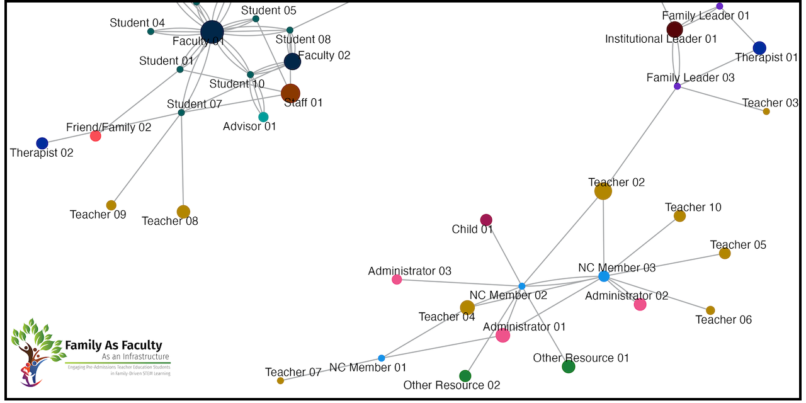
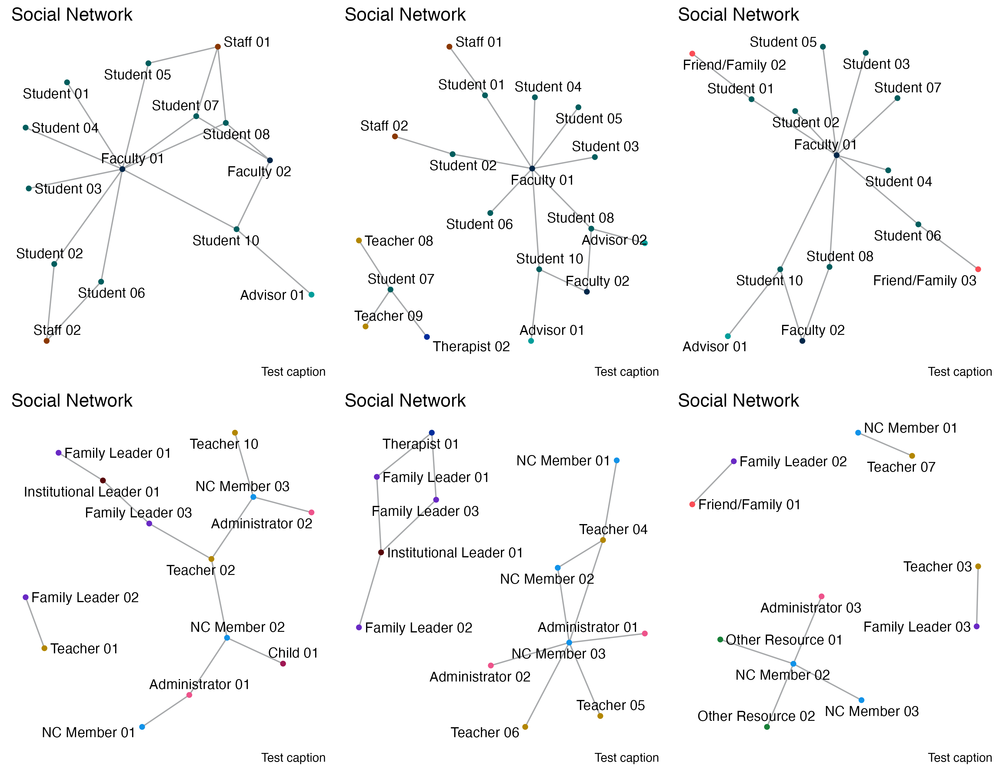
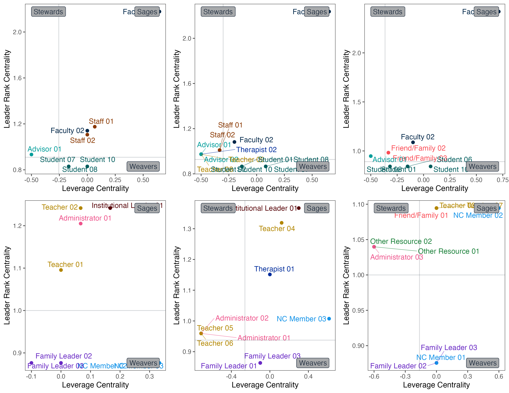

```{r setup, include=FALSE, purl = FALSE}
knitr::opts_chunk$set(echo = FALSE)
```

```{r include = FALSE}
#  __________________________________________________
# |                                                  |
# |     THE ANALYSIS IS NOT THE SOCIAL NETWORK       |
# |  Illuminating the unruly nature of intentional   |
# |  social networks in educational justice efforts  |
# |__________________________________________________|
# |                                                  |
# |   Funded in part by a National Association for   |
# |    Family, School, and Community Engagement      |
# |                    Mini-Grant.                   |
# |__________________________________________________|
```



# Introduction

A social network analysis of a small network that is involved in the Collaborative for Equitable and Inclusive STEM Learning (CEISL) Family as Faculty as an Infrastructure project at the Indiana University School of Education-Indianapolis. Funded in part by a [National Association for Family, School, and Community Engagement Mini-Grant](https://nafsce.org/page/MiniGrant).

We are exploring the following questions through a social network analysis:

* What *intentional social networks* form through an effort between pre-admissions teacher
education students, Neighborhood Caucus members, and Family Leaders through a Family as Faculty
initiative focused on educational justice?
* Considering the social network as a *model*, what dynamics can be uncovered that
provide insight into the ways in which connections and relationships are built through
a Family as Faculty initiative focused on educational justice?
* Understanding the *unruly complexity* of educational justice work and the networks that
emerge, what historical and social impacts can be brought forward to illuminate and
deepen our understanding of how dynamic social networks operate while focusing on
educational justice?

The term *intentional social networks* comes from the work of
Kira Baker-Doyle that demonstrates how educators strategically reach out and construct networks
around their work [@baker-doyleFirstyearTeachersSupport2012; @baker-doyleSocialSideTeacher2020].
*Unruly complexity* comes from the work of Peter Taylor through his critique of models
and his efforts to re-situate model-based research in historical and sociocultural contexts
[@taylorUnrulyComplexityEcology2010; @taylorComplexityConstructionIntersecting2018].

## Components

All components of this work can be found at the project's [OSF repository](https://osf.io/kxhp9/?view_only=eb0fefe6b5bd41b6955c2a4c657e785e).

### File Structure

```
fafi-sna/
┣ aux/                      <- Directory for storing auxiliary files
┃ ┗ fafi-sna-references.bib <- Bibliography for this project in BibTeX format
┃ ┗ theme.css               <- Cascading style sheet for the project
┃ ┗ fafi-sna-logo.png       <- Project logo
┃ ┗ credit.xml              <- Author contributions in a JATS XML file
┣ docs/                     <- Directory for the rendered literate programming file
┃ ┗ index.html              <- Rendered version of the literate programming file
┣ index_cache/              <- Directory used to serve the rendered literate programming file
┣ index_files/              <- Directory used to serve the rendered literate programming file
┣ output/                   <- Target directory for collecting R output files
┃ ┗ plots/                  <- Directory for storing plots in PDF and PNG formats
┃ ┗ csv/                    <- Directory for storing CSV files
┣ R                         <- Directory for storing R scripts
┃ ┗ fafi-sna.R              <- R script distilled from the literate programming file
┣ .gitignore                <- Files and directories to be ignored by Git
┣ .nojekyll                 <- File to tell Github to not use Jekyll
┣ _footer.html              <- The footer for the rendered literate programming file
┣ _site.yml                 <- Configuration file for the rendered literate programming file
┣ CODE_OF_CONDUCT.md        <- Code of Conduct for project contributors
┣ LICENSE                   <- License (MIT) for project
┣ README.md                 <- This file, a general overview of this project
┗ index.Rmd                 <- Literate programming file for the project analysis
```

# Literate Code

Computer scientist Don @knuthLiterateProgramming1984 first coined the term "literate programming" to describe a form of programming that is created as a human-readable narrative. It has been taken up
as a format that is rich in comments and documentation to illustrate and illuminate
the choices and decisions that were made in the act of programming. Literate code is
also an essential aspect of research to promote reproducibility of analysis 
[@dekkerFacilitatingReproducibilityCollaboration2018; @vassilevLanguageagnosticReproducibleData2016].
In this case, as a community-engaged study, we are more interested in exemplifying
trust, transparency, and accountability [@chouSupportingEthicalPractice2020; @mullinsAdvancingCommunityengagedResearch2020; @sabatelloDataSharingCommunityengaged2022a],
literate code provides a clear window for community members and participants into 
the inner processes of data analysis and visualization methodologies.

This is primarily an exercise in *coding as bricolage* [@levi-straussSavageMind1968; @EpistemologicalPluralismRevaluation], so the code itself is neither particularly <abbr title = "Don't Repeat Yourself">DRY</abbr> nor
<abbr title = "Single Level of Abstraction Principle">SLAP</abbr>. But it works and gets
the job done even if there may be more elegant and efficient ways of doing things.

<aside>[Contributors are always welcomed.](https://github.com/jeremyfprice/fafi-sna/blob/main/CODE_OF_CONDUCT.md)</aside>

## Load Libraries

```{r, include = FALSE}
# == LOAD LIBRARIES ============================================================
```

Libraries are packages that are loaded in to extend the functionality to the base R
programming language. This project makes use of three different categories of libraries:
**Network Graph Libraries**, a **Quantitative Anthropology Library**, and **Other R Libraries**.

### Network Graph Libraries

Network Graph Libraries allow for the construction, analysis, and visualization of
social network data. The `igraph` library [@csard2006igraph] is the main social network
analysis engine, while `tidygraph` [@thomas2023tidygraph] and `ggraph` [@pedersen2022ggraph]
provide functionality for processing and visualizing social network graphs, respectively. `Centiserve`&nbsp;[@jalili2017centiserve] provides extended centrality
algorithms.

```{r graph-libraries, message = FALSE, warning = FALSE, echo = TRUE}
library(igraph)
library(tidygraph)
library(ggraph)
library(centiserve)
```

### Quantitative Anthropology Library

Since participants are asked for names and roles, the [data collection process](https://osf.io/5tay8/?view_only=d3b7267695b443d9b6ff773579e77896) is 
essentially a freelisting protocol [@quinlanFreelistingMethod2018]. Under that
assumption, Smith's Salience (S) Score can be calculated. `AnthroTools` [@purzycki2017anthrotools]
provides functionality for working with freelist data and calculating Smith's S.

```{r anthro-libraries, message = FALSE, warning = FALSE, echo = TRUE}
library(AnthroTools)
```

### Other R Libraries

The other libraries utilized for this analysis provide extensions for base R in 
working with data. The `readr` package [@wickham2023readr] allows for efficient and
straightforward reading and writing of local <abbr title="Comma-Separated Values">CSV</abbr> files,
while the `rio` [@chan2021rio] package allows for the reading of web-based <abbr title="Comma-Separated Values">CSV</abbr> files as the datasets for this project are stored in an [OSF repository](https://osf.io/y3xz4/?view_only=b810bc6716624ed0bc843833ee2cf61e). The `glue` [@hester2022glue], `tidyr` [@wickham2023tidyr], and `dplyr` [@wickham2023dplyr]
packages are used to process data. The `ggthemes` package [@arnold2021ggthemes]
provides extended theme options for graphs, `vistime` [@raabe2022vistime] provides functionality
for creating timelines, `ggcorrplot` [@kassambara2022ggcorrplot] provides functionality for
creating correlation plots, and `ggpubr` [@kassambara2023ggpubr] provides functionality for creating
publication-ready plots and graphs.

```{r standard-libraries, message = FALSE, warning = FALSE, echo = TRUE}
library(readr)
library(rio)
library(glue)
library(tidyr)
library(dplyr)
library(gt)
library(ggthemes)
library(ggpubr)
library(ggcorrplot)
library(vistime)
```

## Define Constants

```{r, include = FALSE}
# == DEFINE CONSTANTS ==========================================================
```

The following constants are utilized across the project.

### Common Color Pallete

```{r, include = FALSE}
# -- Define the common color palette -------------------------------------------
```

The [IBM Carbon Design System color pallete](https://carbondesignsystem.com/data-visualization/color-palettes/), a large
color-blind friendly data-oriented color palette, is used to represent various types of
participants. `the_palette` links these participant types with color codes.

```{r color-constants, message = FALSE, warning = FALSE, echo = TRUE}
the_palette <<- c(
  "FL" = "#6929c4", "NC" = "#1192e8", "PA" = "#005d5d",
  "CF" = "#9f1853", "FF" = "#fa4d56", "IL" = "#570408",
  "OR" = "#198038", "OT" = "#002d9c", "SA" = "#ee538b",
  "ST" = "#b28600", "UA" = "#009d9a", "UF" = "#012749",
  "US" = "#8a3800"
)
```

### Participant Abbreviation List

```{r, include = FALSE}
# -- Define the participant abbreviation list ----------------------------------
```

Relatedly, `the_abbrev` dataframe provides links between the abbreviations for the
participant types and the full descriptions of these participant types.

```{r abbrev-constants, message = FALSE, warning = FALSE, echo = TRUE}
the_abbrev <<- data.frame(
  color_code = c(
    "FL", "NC", "FF", "IL", "OR", "OT", "SA",
    "ST", "UA", "UF", "US", "PA", "CF"
  ),
  full = c(
    "Family Leader", "NC Member", "Friend/Family",
    "Institutional Leader", "Other Resource", "Therapist",
    "Administrator", "Teacher", "Advisor", "Faculty",
    "Staff", "Student", "Child"
  )
)
```

## Define Functions

```{r, include = FALSE}
# == DEFINE FUNCTIONS ==========================================================
```

Functions provide "shortcodes" for repeating calculations or analyses multiple times
with different variables, datasets, or networks.

### Helper Functions

Helper functions provide functionality to other functions or ongoing analysis and calculations
across the code.

```{r, include = FALSE}
# -- Save plots as PDF and PNG -------------------------------------------------
```

#### Save Plots Function

This function saves plots to the `output` folder in two formats,
as a `pdf` file and as a `png`. These two formats serve different purposes, so both are useful:
`pdf` files are useful for inclusion in publications and `png` files are useful for distribution
via the web. Both files are set at a high resolution 300<abbr title="Dots Per Inch">dpi</abbr>.

```{r function-plot-save-plot, echo = TRUE}
plot_save <- function(the_plot, the_file) {
  # Set the filename for the PDF.
  pdf_name <- glue("output/plots/{the_file}.pdf")
  # Set the filname for the PNG.
  png_name <- glue("output/plots/{the_file}.png")
  # Save as PDF.
  ggsave(the_plot,
    filename = pdf_name,
    width = 11.5,
    height = 8,
    units = "in",
    dpi = 300
  )
  # Save as PNG.
  ggsave(the_plot,
    filename = png_name,
    width = 11.5,
    height = 8,
    units = "in",
    dpi = 300
  )
}
```

```{r, include = FALSE}
# -- Create Correlation Plot ---------------------------------------------------
```

#### Create Correlation Plot Function

Correlation plots are effective modes of visualizing
relationships between variables. This function takes in a dataframe and creates and saves a
correlation plot while identifying (with an X) correlations that are not statistically significant
(i.e., the $p$-value for non-significant correlations is greater than 0.05).

```{r function-corr-plot, echo = TRUE}
plot_corr <- function(the_frame, the_file) {
  # Calculate the correlation of the provided dataframe.
  corr <- round(cor(the_frame), 1)
  # Calculate a matrix of significance.
  p_mat <- cor_pmat(corr)
  # Initialize plot.
  corr_plot <- ggcorrplot(corr,
    hc.order = TRUE, # Order according to hierarchical clustering.
    type = "lower", # Only display the bottom half.
    p.mat = p_mat, # Account for statistical significance.
    colors = c("#750e13", "#ffffff", "#003a6d")
  ) # Set colors.
  # Save the plot...
  plot_save(corr_plot, the_file)
  # ...and return it.
  return(corr_plot)
}
```

```{r, include = FALSE}
# -- Calculate Tukey's Fences --------------------------------------------------
```

#### Calculate Tukey's Fences Function

Small graphs are prone to extreme outliers, especially
when there are power dynamics such 
as instructor-student relations. While acknowledging this dynamic, it does skew such calculations
as a Key Actor Analysis. Tukey's fences [@hoaglinPerformanceResistantRules1986; @tukeyExploratoryDataAnalysis1993] is one way to remove the impact of these outliers.

```{r function-calculate-tukey, echo = TRUE}
calculate_tukey <- function(the_cent) {
  # Calculate Tukey's fences
  q <- quantile(the_cent, c(0.25, 0.75))
  iqr <- q[2] - q[1]
  the_fence <- data.frame(
    lower = q[1] - 1.5 * iqr,
    upper = q[2] + 1.5 * iqr
  )
  return(the_fence)
}
```

### Network Graph Functions

```{r, include = FALSE}
# -- Prepare the data and initialize the graph object --------------------------
```

#### Initialize Network Graph Function

The `set_graph` function takes in an edge list that
provides a representation of who participants named in the survey and converts it into a
network graph object. Extra variables are added to the graph:

* `weight`, which is the number of times $i$ (the participant) names $j$ on the survey, 
which is used to *weight* the relationships between actors.
* `color_code`, which is just the first two letters of actor id that allows reference to the
color palette to set the color of the node when the graph is plotted.
* `size_code`, which is the Smith's Salience Score for $j$ (multiplied by 100) to set the size
of the node when the graph is plotted.
* `label`, which is the abbreviation expanded with the ID number for easier reading when the
graph is plotted.

The graph and these variables are passed on for plotting and calculating centralities. Several
of the centrality algorithms account for `weight` when calculating the centrality.

```{r function-set-graph, echo = TRUE}
set_graph <- function(the_frame, the_salience) {
  # Reduce the edge list to just i (from) and j (to).
  the_frame <- the_frame |>
    select("from", "to")
  # Calculate the number of times i names j.
  the_weight <- the_frame |>
    group_by(from, to) |>
    summarize(weight = n()) |>
    ungroup()
  # Combine the dataframes into one, matching the weight to the edge.
  the_frame <- merge(the_frame, the_weight, by = c("from", "to"))
  # Create the igraph object, and set it to be a directed graph (i.e., i -> j).
  the_graph <- the_frame |>
    graph_from_data_frame(directed = TRUE)
  the_salience <- the_salience |> rename("name" = "actor")
  node_data <- data.frame(name = V(the_graph)$name) |>
    mutate(id_no = substr(V(the_graph)$name, 3, 4)) |>
    mutate(color_code = substr(V(the_graph)$name, 1, 2)) |>
    left_join(the_salience) |>
    left_join(the_abbrev) |>
    mutate(label = glue("{full} {id_no}")) |>
    replace_na(list(SmithsS = 0.01))
  V(the_graph)$color_code <- node_data$color_code
  V(the_graph)$size_code <- (node_data$SmithsS) * 100
  V(the_graph)$label <- node_data$label
  # Send the graph object back for further processing.
  return(the_graph)
}
```


```{r, include = FALSE}
# -- Plot the graph object -----------------------------------------------------
```

#### Plot the Graph Function

The `draw_graph` creates the visualization--the plot--of the
social network graph and then saves it for further use. The `geom_edge_fan`
feature is used to represent the number of times a participant named an actor.

```{r function-draw-graph, echo = TRUE}
draw_graph <- function(the_graph, the_file) {
  # Set the filename for saving the graph.
  the_file <- glue("sna_{the_file}-plot")
  # Set a reproducible seed for randomization, used to ensure that the plot looks more or less
  # the same each time it is created.
  set.seed(123)
  # Create the plot.
  the_plot <- the_graph |>
    ggraph(layout = "fr") + # Display the graph using the Fruchterman and Reingold algorithm.
    geom_edge_fan(color = "#A7A9AB") + # Plot the edges between nodes.
    geom_node_point(
      aes(
        color = color_code, # Plot the nodes with the color determined by the
        linewidth = size_code
      ), # participant and the size of the node determined
      show.legend = FALSE
    ) + # by the Smith's S Salience Score.
    scale_size_continuous(range = c(2.5, 10)) + # Rescale the node size.
    scale_color_manual(values = the_palette) + # Bring in the color palette.
    geom_node_text(aes(label = label), repel = TRUE) + # Place the actor name on the graph.
    labs(
      edge_width = "Letters",
      title = "Social Network",
      caption = "Test caption"
    ) +
    theme_few() +
    theme(
      axis.text = element_blank(),
      axis.ticks = element_blank(),
      axis.title = element_blank(),
      panel.border = element_blank()
    )
  # Save the plot.
  plot_save(the_plot, the_file)
  # Return the plot for further use as necessary.
  return(the_plot)
}
```

#### Calculate Network Centralities Function

A number of *node-level centralities,* or metrics,
are calculated on the graphs and are utilized for the analysis. *Nodes* are the graphical
representation of *actors* and *edges* are the graphical representation of *relationships*
between actors.

* **Degree (In) Centrality.** The number of *incoming* edges *from* other actors 
[@borgattiCentralityConceptsMeasures2019; @everettCentralityGroupsClasses1999].
* **Degree (Out) Centrality.** The number of *outgoing* edges *to* other actors 
[@borgattiCentralityConceptsMeasures2019; @everettCentralityGroupsClasses1999].
* **Laplacian Centrality.** The "what will happen when I'm gone" centrality, an indication of how *indispensible* an actor is based on the structural resilience of the network and how the network can "fill in" if a node is removed [@qiLaplacianCentralityNew2012].
* **Latora Closeness Centrality.** A measure of *efficiency* of network graphs, particularly small
and potentially disconnected graphs, indicating how efficiently information moves through the actor
and across the network [@latoraEfficientBehaviorSmallworld2001].
* **Leader Rank Centrality.** A measure of influence, identifying actors who facilitate the rapid
and wide spread of information across the network, an algorithm developed specifically for
social networks rather than similar algorithms designed for web pages 
[@luLeadersSocialNetworks2011].
* **Leverage Centrality.** A measure of how "in the thick of it" an actor is, based on who they are connected to and who those actors are connected to, while accounting for parallel, not just serial, flows of information [@joyceNewMeasureCentrality2010].

```{r function-calculate-centrality, echo = TRUE}
calculate_centrality <- function(the_graph, the_salience, the_file) {
  analysis_network_data <- data.frame(
    indegree = igraph::degree(the_graph, mode = "in"),
    outdegree = igraph::degree(the_graph, mode = "out"),
    leaderrank = leaderrank(the_graph),
    laplace = laplacian(the_graph),
    leverage = leverage(the_graph),
    latora = closeness.latora(the_graph)
  )
  analysis_network_data$actor <- rownames(analysis_network_data)
  rownames(analysis_network_data) <- NULL
  analysis_network_data <- analysis_network_data |>
    select(actor, everything()) |>
    left_join(the_salience) |>
    replace_na(list(SmithsS = 0))
  rownames(analysis_network_data) <- analysis_network_data$actor
  return(analysis_network_data)
}
```

#### Calculate Named Actors Salience Scores Function

```{r function-calculate-salience, echo = TRUE}
calculate_salience <- function(the_frame, the_grouping, the_file) {
  the_filename <- glue("output/csv/salience_{the_file}.csv")
  anthro_frame <- the_frame |>
    select("Subj" = "from", "Order" = "order", "CODE" = "to", "GROUPING" = "question") |>
    add_count(Subj, GROUPING) |>
    filter(n > 1)
  if (the_grouping == "none") {
    anthro_frame <- anthro_frame |>
      select("Subj", "Order", "CODE") |>
      distinct() |>
      as.data.frame()
    anthro_frame$Order <- as.numeric(anthro_frame$Order)
    the_salience <- CalculateSalience(anthro_frame)
  } else {
    anthro_frame <- anthro_frame |>
      select("Subj", "Order", "CODE", "GROUPING") |>
      distinct() |>
      as.data.frame()
    anthro_frame$Order <- as.numeric(anthro_frame$Order)
    the_salience <- CalculateSalience(anthro_frame, GROUPING = "GROUPING")
  }
  code_salience <- SalienceByCode(the_salience, dealWithDoubles = "MAX")
  write_csv(code_salience, the_filename, append = FALSE)
  code_salience <- code_salience |>
    select("actor" = "CODE", "SmithsS")
  return(code_salience)
}
```

### Key Actor Functions

#### Identify Key Actors Function

```{r function-calculate-keyactors, echo = TRUE}
calculate_keyactors <- function(the_frame, the_file) {
  max_leverage <- max(the_frame$leverage, na.rm = TRUE)
  min_leverage <- min(the_frame$leverage, na.rm = TRUE)
  key_frame <- the_frame %>%
    select(actor, leverage, leaderrank, SmithsS)
  key_res <- lm(leaderrank ~ leverage, data = key_frame)$residuals |>
    as.data.frame() |>
    rename(res = 1) |>
    mutate(res = abs(res))
  key_res$actor <- row.names(key_res)
  row.names(key_res) <- NULL
  key_frame <- key_frame |>
    left_join(key_res)
  leaderrank_fence <- calculate_tukey(key_frame$leaderrank)
  key_frame_leaderrank_trimmed <- key_frame |>
    filter(leaderrank >= leaderrank_fence$lower & leaderrank <= leaderrank_fence$upper)
  leverage_fence <- calculate_tukey(key_frame$leverage)
  key_frame_leverage_trimmed <- key_frame |>
    filter(leverage >= leverage_fence$lower & leverage_fence$upper)
  key_ymean <<- mean(key_frame_leaderrank_trimmed$leaderrank)
  key_xmean <<- mean(key_frame_leverage_trimmed$leverage)
  key_frame <- key_frame |>
    mutate(keystatus = case_when(
      (leaderrank > key_ymean & leverage > key_xmean) ~ "Sage",
      (leaderrank > key_ymean & leverage < key_xmean) ~ "Steward",
      (leaderrank < key_ymean & leverage > key_xmean) ~ "Weaver"
    )) |>
    na.omit() |>
    group_by(keystatus) |>
    arrange(desc(res), desc(SmithsS)) |>
    unique() |>
    ungroup()
  key_frame <- key_frame |>
    select(actor, leverage, leaderrank, res, SmithsS, keystatus) |>
    arrange(keystatus, desc(res), desc(SmithsS))
  return(key_frame)
}
```

#### Plot Key Actors Function

```{r function-plot-keyactors, echo = TRUE}
plot_keyactors <- function(key_frame, the_file) {
  the_filename <- glue("keyactors_{the_file}-plot")
  key_xmin <- min(key_frame$leverage)
  key_xmax <- max(key_frame$leverage)
  key_ymin <- min(key_frame$leaderrank)
  key_ymax <- max(key_frame$leaderrank)
  steward_count <- count_keyactors(key_frame, "Steward")
  sage_count <- count_keyactors(key_frame, "Sage")
  weaver_count <- count_keyactors(key_frame, "Weaver")
  key_frame <- key_frame |>
    mutate(color_code = substr(key_frame$actor, 1, 2)) |>
    mutate(id_no = substr(key_frame$actor, 3, 4)) |>
    left_join(the_abbrev) |>
    mutate(label = glue("{full} {id_no}")) |>
    select(-full, -id_no)
  key_plot <- ggscatter(key_frame,
    x = "leverage", y = "leaderrank",
    label = "label", label.rectangle = FALSE, repel = TRUE,
    theme = theme_minimal(), ylab = "Leader Rank Centrality",
    xlab = "Leverage Centrality", point = TRUE, show.legend = FALSE,
    color = "color_code", palette = the_palette,
    conf.int = FALSE, cor.coef = FALSE, legend = "none"
  )
  if (steward_count != 0) {
    key_plot <- key_plot +
      geom_vline(xintercept = key_xmean, color = "#243142", alpha = 0.2) +
      geom_label(aes(x = key_xmin, y = key_ymax, label = "Stewards", hjust = 0),
        color = "#243142", fill = "#A7A9AB"
      )
  }
  if (weaver_count != 0) {
    key_plot <- key_plot +
      geom_hline(yintercept = key_ymean, color = "#243142", alpha = 0.2) +
      geom_label(aes(
        x = key_xmax, y = key_ymin,
        label = "Weavers", hjust = 1
      ), color = "#243142", fill = "#A7A9AB")
  }
  key_plot <- key_plot +
    geom_label(aes(
      x = key_xmax, y = key_ymax,
      label = "Sages", hjust = 1
    ), color = "#243142", fill = "#A7A9AB") +
    theme_few() +
    theme(legend.position = "none")
  plot_save(key_plot, the_filename)
  return(key_plot)
}
```

#### Count Key Actors Function

```{r function-count-keyactors, echo = TRUE}
count_keyactors <- function(key_frame, the_actor) {
  the_count <- key_frame |>
    count(keystatus) |>
    filter(keystatus == the_actor) |>
    pull(n)
  the_count <- ifelse(is.numeric(the_count), the_count, 0)
  the_count <- the_count |> replace_na(0)
  return(the_count)
}
```

#### Process Key Actor Data Functions

```{r function-create-q-key, message=FALSE, warning=FALSE, echo = TRUE, results = FALSE}
create_q_key <- function(the_1, the_2, the_question) {
  the_q_key <- bind_rows(the_1, the_2) |>
    mutate(question = the_question) |>
    select(question, actor, keystatus)
  return(the_q_key)
}
```

### Deeper Analysis Functions

#### Combine Multiplex Graph Layers Functions

```{r function-create-q-cent, echo = TRUE}
create_q_cent <- function(the_1, the_2, the.question) {
  the_q_cent <- bind_rows(the_1, the_2) |>
    mutate(question = the.question) |>
    select(
      question, actor, outdegree, indegree, leverage,
      laplace, leaderrank, latora, SmithsS
    )
}

calculate_ranks <- function(the_cent) {
  the_cent <- the_cent |>
    mutate(outdegree_rank = dense_rank(desc(outdegree))) |>
    mutate(indegree_rank = dense_rank(desc(indegree))) |>
    mutate(leverage_rank = dense_rank(desc(leverage))) |>
    mutate(laplacian_rank = dense_rank(desc(laplace))) |>
    mutate(leaderrank_rank = dense_rank(desc(leaderrank))) |>
    mutate(smiths_rank = dense_rank(desc(SmithsS))) |>
    mutate(latora_rank = dense_rank(desc(latora))) |>
    select(
      question, actor, outdegree, outdegree_rank, indegree, indegree_rank,
      leverage, leverage_rank, laplace, laplacian_rank,
      latora, latora_rank, leaderrank, leaderrank_rank, SmithsS, smiths_rank
    ) |>
    arrange(question, actor)
  rownames(the_cent) <- NULL
  return(the_cent)
}
```

### Calculate Situational Flexibility Score Functions

#### Calculate Jaccard Index Function

The Jaccard Similarity Index is a measure of how similar two sets of information are,
with a range between 0 (nothing is the same) and 1 (everything is the same).

$J$, the Jaccard Similarity Index, is calculated with the following formula:

<p style="text-align: center">$J(p,q) = \frac{|p \cap q|}{|p \cup q|}$</p>

where $p$ and $q$ are sets of information. The absolute value of the union of $p$ and $q$,
or the number of items they have in common, is divided by the absolute value of the
intersection of $p$ and $q$, or the number of total unique items across the both sets.

This value is then passed back to the Situational Flexibility Score $(f_S)$ function for further processing.

```{r function calculate-jaccard, message=FALSE, warning=FALSE, echo = TRUE, results = FALSE}
calculate_jaccard <- function(the_set_1, the_set_2) {
  the_jaccard <- (length(intersect(the_set_1$to, the_set_2$to)) / length(union(the_set_1$to, the_set_2$to)))
  return(the_jaccard)
}
```

#### Calculate Situational Flexibility Score Function

The Situational Flexibility Score $(f_S)$ builds upon the standard community-based flexibility
score [@porter2014multilayernetworks]. In this case, *situational flexibility* refers
to is a measure of the breadth of connections
actors have to address situational information needs. Expanding upon the in degree and
out degree centralities, situational degree looks at degree measures in a nuanced
manner over the layers of a situation-oriented multilayered network graph.

The Actor Situational Flexibility Score is calculated with the following formula:

<p style="text-align: center;">$f_S = 1 - (\frac{\frac{1}{m(m-1)} \sum_{p\neq q} J(set_p,\ set_q)}{\max_{p,q} J(set_p,\ set_q)})$</p>

where $m$ is the total number of sets, $p$ and $q$ represent the sets, and $J$ represents
the Jaccard Index. The calculation proceeds by dividing the sum of the Jaccard Indices
by the possible total sum of Jaccard Indices. In this case, there are three sets,
so the sum of the three Jaccard Indices is divided by 3. This value is subtracted from 1
to indicate difference rather than similarity.

```{r function-calculate-node-flexibility, message=FALSE, warning=FALSE, echo = TRUE, results = FALSE}
calculate_situational_flexibility <- function(the_actor) {
  set1 <- flex_frame |>
    filter(actor == the_actor & question == "Q1") |>
    select(actor, to) |>
    as.data.frame()
  set1$actor <- as.factor(set1$actor)
  set1$to <- as.factor(set1$to)
  set2 <- flex_frame |>
    filter(actor == the_actor & question == "Q3") |>
    select(actor, to) |>
    as.data.frame()
  set2$actor <- as.factor(set2$actor)
  set2$to <- as.factor(set2$to)
  set3 <- flex_frame |>
    filter(actor == the_actor & question == "Q4") |>
    select(actor, to) |>
    as.data.frame()
  set3$actor <- as.factor(set3$actor)
  set3$to <- as.factor(set3$to)
  jaccard_1 <- calculate_jaccard(set1, set2)
  jaccard_2 <- calculate_jaccard(set2, set3)
  jaccard_3 <- calculate_jaccard(set1, set3)
  # the_flexibility <- 1 - ((1 / (3 * (3 - 1)) * (jaccard_1 + jaccard_2 + jaccard_3)) / 3)
  the_flexibility <- 1 - ((jaccard_1 + jaccard_2 + jaccard_3) / 3)
  response_frame <- data.frame(actor = the_actor, flexibility = the_flexibility)
  return(response_frame)
}
```

# Processing The Data

### Reading the Data

```{r read-data, message=FALSE, warning=FALSE, echo = TRUE, results = FALSE}
pates_frame <- import("https://osf.io/download/62qpa/", format = "csv") |>
  mutate_all(toupper) |>
  filter(id != "PA09") |>
  pivot_longer(
    cols = starts_with("Q"),
    names_to = "question",
    values_to = "to"
  ) |>
  drop_na() |>
  select("question", "from" = "id", "to") |>
  separate(col = question, into = c("question", "order"), sep = "_") |>
  filter(to != "")
write_csv(pates_frame, "output/csv/pates_frame.csv")

ncfl_frame <- import("https://osf.io/download/ghz3c/", format = "csv") |>
  mutate_all(toupper) |>
  pivot_longer(
    cols = starts_with("Q"),
    names_to = "question",
    values_to = "to"
  ) |>
  drop_na() |>
  select("question", "from" = "ID", "to") |>
  separate(col = question, into = c("question", "order"), sep = "_") |>
  filter(to != "")
write_csv(ncfl_frame, "output/csv/ncfl_frame.csv")

full_frame <- rbind(pates_frame, ncfl_frame)
```

### Create Overall Graph

```{r process-full, echo = TRUE, results = FALSE}
full_salience <- calculate_salience(full_frame, "GROUPING", "full")
full_graph <- set_graph(full_frame, full_salience)
full_plot <- draw_graph(full_graph, "full")
```

```{r save-full-sna, echo = FALSE, purl = FALSE, dpi=300}
# Save a copy of the network to be displayed below
ggsave(full_plot, filename = "aux/sna_full-plot.png", width = 11.5, height = 8, units = "in", dpi = 300)
knitr::include_graphics("aux/sna_full-plot.png")
```

### Process Questions

```{r process-questions, echo = TRUE, results = FALSE}
pates_q1_frame <- pates_frame |>
  filter(question == "Q1")
pates_q1_salience <- calculate_salience(pates_q1_frame, "GROUPING", "Q1")
pates_q1_graph <- set_graph(pates_q1_frame, pates_q1_salience)
pates_q1_plot <- draw_graph(pates_q1_graph, "q1_pates")
pates_q1_cent <- calculate_centrality(pates_q1_graph, pates_q1_salience, "q1_pates")
pates_q1_key <- calculate_keyactors(pates_q1_cent, "q1_pates")
pates_q1_key_plot <- plot_keyactors(pates_q1_key, "q1_pates")

ncfl_q1_frame <- ncfl_frame |>
  filter(question == "Q1")
ncfl_q1_salience <- calculate_salience(ncfl_q1_frame, "GROUPING", "Q1")
ncfl_q1_graph <- set_graph(ncfl_q1_frame, ncfl_q1_salience)
ncfl_q1_plot <- draw_graph(ncfl_q1_graph, "q1_ncfl")
ncfl_q1_cent <- calculate_centrality(ncfl_q1_graph, ncfl_q1_salience, "q1_ncfl")
ncfl_q1_key <- calculate_keyactors(ncfl_q1_cent, "q1_ncfl")
ncfl_q1_key_plot <- plot_keyactors(ncfl_q1_key, "q1_ncfl")

pates_q3_frame <- pates_frame |>
  filter(question == "Q3")
pates_q3_salience <- calculate_salience(pates_q3_frame, "GROUPING", "Q3")
pates_q3_graph <- set_graph(pates_q3_frame, pates_q3_salience)
pates_q3_plot <- draw_graph(pates_q3_graph, "q3_pates")
pates_q3_cent <- calculate_centrality(pates_q3_graph, pates_q3_salience, "q3_pates")
pates_q3_key <- calculate_keyactors(pates_q3_cent, "q3_pates")
pates_q3_key_plot <- plot_keyactors(pates_q3_key, "q3_pates")

ncfl_q3_frame <- ncfl_frame |>
  filter(question == "Q3")
ncfl_q3_salience <- calculate_salience(ncfl_q3_frame, "GROUPING", "Q3")
ncfl_q3_graph <- set_graph(ncfl_q3_frame, ncfl_q3_salience)
ncfl_q3_plot <- draw_graph(ncfl_q3_graph, "q3_ncfl")
ncfl_q3_cent <- calculate_centrality(ncfl_q3_graph, ncfl_q3_salience, "q3_ncfl")
ncfl_q3_key <- calculate_keyactors(ncfl_q3_cent, "q3_ncfl")
ncfl_q3_key_plot <- plot_keyactors(ncfl_q3_key, "q3_ncfl")

pates_q4_frame <- pates_frame |>
  filter(question == "Q4")
pates_q4_salience <- calculate_salience(pates_q4_frame, "GROUPING", "Q4")
pates_q4_graph <- set_graph(pates_q4_frame, pates_q4_salience)
pates_q4_plot <- draw_graph(pates_q4_graph, "q4_pates")
pates_q4_cent <- calculate_centrality(pates_q4_graph, pates_q4_salience, "q4_pates")
pates_q4_key <- calculate_keyactors(pates_q4_cent, "q4_pates")
pates_q4_key_plot <- plot_keyactors(pates_q4_key, "q4_pates")

ncfl_q4_frame <- ncfl_frame |>
  filter(question == "Q4")
ncfl_q4_salience <- calculate_salience(ncfl_q4_frame, "GROUPING", "Q4")
ncfl_q4_graph <- set_graph(ncfl_q4_frame, ncfl_q4_salience)
ncfl_q4_plot <- draw_graph(ncfl_q4_graph, "q4_ncfl")
ncfl_q4_cent <- calculate_centrality(ncfl_q4_graph, ncfl_q4_salience, "q4_ncfl")
ncfl_q4_key <- calculate_keyactors(ncfl_q4_cent, "q4_ncfl")
ncfl_q4_key_plot <- plot_keyactors(ncfl_q4_key, "q4_ncfl")
```

```{r grid-sna, purl=FALSE}
# This codeblock is here simply to create a high-resolution image for
# display in this literate code document. This is excluded from the
# generation of the R script.

# Bring the plots together.
grid_sna <- ggarrange(pates_q1_plot, pates_q3_plot, pates_q4_plot,
  ncfl_q1_plot, ncfl_q3_plot, ncfl_q4_plot,
  ncol = 3, nrow = 2
)

# Save them as a high resolution image.
ggsave(grid_sna, filename = "aux/grid-sna.png", width = 11, height = 8.5, units = "in", dpi = 300)

```

```{r grid-key, purl=FALSE}
# This codeblock is here simply to create a high-resolution image for
# display in this literate code document. This is excluded from the
# generation of the R script.

# Bring the plots together.
grid_sna <- ggarrange(pates_q1_key_plot, pates_q3_key_plot, pates_q4_key_plot,
  ncfl_q1_key_plot, ncfl_q3_key_plot, ncfl_q4_key_plot,
  ncol = 3, nrow = 2
)

# Save them as a high resolution image.
ggsave(grid_sna, filename = "aux/grid-key.png", width = 11, height = 8.5, units = "in", dpi = 300)

```

# Analyzing the Data

### Preparing the Scores

#### Calculate Actor Flexibility Score

```{r calculate-actor-flexibility, echo = TRUE}
# Calculating Actor Flexibility Score
flex_frame <<- full_frame |>
  select(question, actor = from, to)

flex_results <- lapply(unique(flex_frame$actor), calculate_situational_flexibility)
flex_score <- do.call(rbind, flex_results)
```

#### Calculate Key Actor Score

```{r calculate-key-actor-score, echo = TRUE, results = FALSE}
q1_key <- create_q_key(pates_q1_key, ncfl_q1_key, "q1")
q3_key <- create_q_key(pates_q3_key, ncfl_q3_key, "q3")
q4_key <- create_q_key(pates_q4_key, ncfl_q4_key, "q4")
q_key <<- bind_rows(q1_key, q3_key, q4_key) |>
  select(actor, keystatus) |>
  mutate(keyscore = case_when(
    keystatus == "Sage" ~ 3,
    keystatus == "Steward" ~ 2,
    keystatus == "Weaver" ~ 1
  )) |>
  group_by(actor) |>
  summarize(keyscore = sum(keyscore)) |>
  mutate(keyscore = keyscore / 9)
```

#### Create Rankings for Comparing Across Graphs

Because this is a multilayered graph
that includes information across a range of contexts in response to different prompts,
*the calculated centralities themselves cannot be compared* because this is like comparing
a golden delicious to a honey crisp apple. Instead, relative ranks can be compared across
the multiple layers of the graphs: how did actor $i$ rank compare to the others? This ranking
provides a picture across contexts and prompts.

Blah blah blah.

```{r create-rankings-frames, echo = TRUE, results = FALSE}
q1_cent <- create_q_cent(pates_q1_cent, ncfl_q1_cent, "q1") |>
  calculate_ranks()
q3_cent <- create_q_cent(pates_q3_cent, ncfl_q3_cent, "q3") |>
  calculate_ranks()
q4_cent <- create_q_cent(pates_q4_cent, ncfl_q4_cent, "q4") |>
  calculate_ranks()
q_cent <<- bind_rows(q1_cent, q3_cent, q4_cent)
```

```{r create-rankings-overall, echo = TRUE, results = TRUE}
full_avg_cent <- q_cent |>
  select(
    actor, leverage_rank, laplacian_rank, outdegree_rank, indegree_rank,
    latora_rank, leaderrank_rank, smiths_rank
  ) |>
  group_by(actor) |>
  summarize(across(everything(), mean), .groups = "drop") |>
  left_join(flex_score) |>
  left_join(q_key) |>
  replace_na(list(flexibility = 0, keyscore = 0)) |>
  mutate(flexibility_rank = dense_rank(desc(flexibility))) |>
  mutate(keyscore_rank = dense_rank(desc(keyscore))) |>
  ungroup() |>
  as.data.frame()
```

Put in a correlation plot here that compares all the ranks.

```{r, cache = TRUE}
corr_avg <- full_avg_cent |>
  select(-flexibility, -keyscore, -actor) |>
  plot_corr("rank-corr")
print(corr_avg)
```

### Analyze Key Actors

We look at the key actors in this project as contributors to the social network through 
three **perspectives** (really need to come up with a better word than that):

* **Positionality.** Laplacian Centrality and Leverage Centrality
* **Reachability.** Latora Closeness Centrality and In Degree Centrality
* **Reputation.** Leader Rank Centrality and Smith's S Score

$\frac{1}{{\text{avg}(R_{\text{p}},\ R_{\text{q}})}} \times 10$

```{r analyze-key-actors, echo = TRUE, results = FALSE}
keyactors_q_frame <- q_key |>
  left_join(q1_key) |>
  left_join(q3_key, by = "actor") |>
  left_join(q4_key, by = "actor") |>
  select(actor,
    q1_status = keystatus.x, q3_status = keystatus.y,
    q4_status = keystatus
  ) |>
  arrange(actor)

keyactors_frame <- full_avg_cent |>
  filter(keyscore > 0) |>
  mutate(positionality_score = ((1 / (laplacian_rank + leverage_rank) / 2)) * 10) |>
  mutate(reputation_score = ((1 / (smiths_rank + leaderrank_rank) / 2)) * 10) |>
  mutate(reachability_score = ((1 / (latora_rank + indegree_rank) / 2)) * 10) |>
  mutate(overall_score = (positionality_score + reputation_score + reachability_score) / 3) |>
  select(
    actor, overall_score, positionality_score, reachability_score, reputation_score,
    keyscore, keyscore_rank
  ) |>
  left_join(keyactors_q_frame) |>
  unique() |>
  arrange(desc(overall_score))
write_csv(keyactors_frame, file = "output/csv/keyactors_analysis.csv")
```

```{r write-keyactors, results = TRUE, purl = FALSE}
keyactors_frame |>
  select(-keyscore, -keyscore_rank) |>
  head(n = 15) |>
  gt() |>
  opt_table_font(font = list(google_font("JetBrains Mono"), default_fonts())) |>
  tab_options(
    table.font.size = 14,
    data_row.padding = px(3),
    row.striping.include_table_body = TRUE,
    row.striping.background_color = "#00000011"
  ) |>
  sub_missing(missing_text = " ") |>
  tab_spanner(label = "Key Actor Roles", columns = 6:8) |>
  tab_spanner(label = "Network Scores", columns = 3:5)
```

It is important to recognize that it's all OK, and I hope this works.

```{r keyactor-analysis-corr-plot, echo = TRUE, cache=TRUE}
keyactors_corr <- keyactors_frame |>
  select(positionality_score, reachability_score, reputation_score) |>
  plot_corr("keyactors-corr")
print(keyactors_corr)
```

### Analyze Participant Actors

We look at the participants in this project--the Pre-Admissions Teacher Education Students,
the Neighborhood Caucus members, and the Family Leaders--as contributors to the social
network through three **perspectives** (really need to come up with a better word than that):

* **Positionality.** Laplacian Centrality and Leverage Centrality
* **Reachability.** Latora Closeness Centrality and Out Degree Centrality
* **Potentiality.** Flexibility Score and Reputation Score

```{r analyze-participant-actors, echo = TRUE, results = FALSE}
key_reputation <- keyactors_frame |>
  select(actor, reputation_score)
participants_frame <- full_avg_cent |>
  left_join(key_reputation) |>
  filter(substr(actor, 1, 2) == "PA" | substr(actor, 1, 2) == "FL" | substr(actor, 1, 2) == "NC") |>
  mutate(reputation_rank = dense_rank(desc(reputation_score))) |>
  replace_na(list(reputation_rank = 0))
reputation_rank_na <- (max(participants_frame$reputation_rank)) + 1
participants_frame <- participants_frame |>
  mutate(reputation_rank = if_else(reputation_rank == 0, reputation_rank_na, reputation_rank)) |>
  mutate(potentiality_score = ((1 / (flexibility_rank + reputation_rank) / 2)) * 10) |>
  mutate(positionality_score = ((1 / (laplacian_rank + leverage_rank) / 2)) * 10) |>
  mutate(reachability_score = ((1 / (latora_rank + outdegree_rank) / 2)) * 10) |>
  # mutate(potentiality_score = (((flexibility_rank + reputation_rank) / 2))) |>
  # mutate(positionality_score = (((laplacian_rank + leverage_rank) / 2))) |>
  # mutate(reachability_score = (((latora_rank + outdegree_rank) / 2))) |>
  mutate(
    overall_score =
      (potentiality_score +
        positionality_score +
        reachability_score)
      / 3
  ) |>
  select(
    actor,
    overall_score,
    positionality_score,
    reachability_score,
    potentiality_score,
    laplacian_rank,
    leverage_rank,
    latora_rank,
    outdegree_rank,
    flexibility_rank,
    keyscore_rank,
    reputation_rank
  ) |>
  arrange(desc(overall_score)) |>
  as.data.frame()
write_csv(participants_frame,
  file = "output/csv/participants_analysis.csv"
)
```

```{r write-participant-actors, results = TRUE, purl = FALSE}
participants_frame |>
  select(
    actor,
    overall_score,
    positionality_score,
    reachability_score,
    potentiality_score
  ) |>
  gt() |>
  opt_table_font(
    font = list(google_font("JetBrains Mono"), default_fonts())
  ) |>
  tab_options(
    table.font.size = 14,
    data_row.padding = px(3),
    row.striping.include_table_body = TRUE,
    row.striping.background_color = "#00000011"
  )
```

It is important to recognize that it's all OK, and I hope this works.

```{r participant-analysis-corr-plot, echo = TRUE, cache=TRUE}
participants_corr <- participants_frame |>
  select(
    positionality_score,
    reachability_score,
    potentiality_score
  ) |>
  plot_corr("participants-corr")
print(participants_corr)
```

# Initial Reflections

```{r plot-overall-scores, cache = TRUE}
overall_frame <- participants_frame |>
  select(actor, overall_score) |>
  mutate(color_code = substr(actor, 1, 2))
overall_plot <- ggstripchart(
  overall_frame,
  x = "color_code",
  y = "overall_score",
  label = "actor",
  repel = TRUE,
  color = "color_code",
  palette = "the_palette",
  fill = "color_code",
  label.rectangle = FALSE,
  show.legend = FALSE,
  label.color = "color_code",
  xlab = "Network",
  ylab = "Overall Score"
) +
  ggtitle("Participants") +
  theme_few() +
  theme(legend.position = "none")
plot_save(overall_plot, "overall-corr")
print(overall_plot)
```

## Providing Context

*Unruly complexity* comes from the work of Peter Taylor through his critique of models
and his efforts to re-situate model-based research in historical and sociocultural contexts
[@taylorUnrulyComplexityEcology2010; @taylorComplexityConstructionIntersecting2018].

### Consider Sociocultural Ontologies

[@dorpinghausSocialNetworksKnowledge2022; @porterCommunitiesNetworks2009]

### Consider Sociohistorical Context

```{r unruly-timeline, echo = TRUE, results = TRUE, warning = FALSE, message=FALSE}
timeline_frame <- read_csv("data/timeline-data.csv",
  col_names = TRUE,
  show_col_types = FALSE
)
timeline_frame$layer <- factor(timeline_frame$layer,
  levels = c("act", "local", "sped", "policy", "epoch")
)
timeline_plot <- gg_vistime(timeline_frame,
  col.event = "event", col.group = "layer",
  col.start = "start", col.end = "end", optimize_y = FALSE,
  title = "Multilayered Timeline",
  background_lines = NULL
) +
  theme_few() +
  geom_segment(
    aes(
      x = as.POSIXct("1954-01-30"), y = 9,
      xend = as.POSIXct("1956-01-30"), yend = 31.5
    ),
    color = "#A7A9AB", linetype = 2, linewidth = 0.65
  ) +
  geom_segment(
    aes(
      x = as.POSIXct("1959-01-30"), y = 31.75,
      xend = as.POSIXct("1968-01-30"), yend = 31
    ),
    color = "#A7A9AB", linetype = 2, linewidth = 0.65
  ) +
  geom_segment(
    aes(
      x = as.POSIXct("1970-01-30"), y = 22,
      xend = as.POSIXct("1970-01-30"), yend = 30.5
    ),
    color = "#A7A9AB", linetype = 2, linewidth = 0.65
  )
plot_save(timeline_plot, "timeline")
```

```{r save-timeline, echo = FALSE, purl = FALSE, dpi=300, layout = "l-page"}
# Save a copy of the network to be displayed below
ggsave(timeline_plot,
  filename = "aux/timeline-plot.png",
  width = 18,
  height = 6,
  units = "in",
  dpi = 300
)
knitr::include_graphics("aux/timeline-plot.png")
```

## Acknowledgments {.appendix}

This is work is funded in part by a [National Association for Family, School, and 
Community Engagement (NAFSCE) Mini-Grant](https://nafsce.org/page/MiniGrant).

## Author Contributions {.appendix}

```{r}
author_contributions <- data.frame(
  Role = c(
    "Conceptualization", "Data Curation",
    "Formal Analysis", "Funding Acquisition",
    "Investigation", "Methodology",
    "Project Administration", "Software",
    "Supervision", "Visualization",
    "Writing - Original Draft",
    "Writing - Review & Editing"
  ),
  Authors = c(
    "Jeremy F Price, Cristinia Santamaría Graff", "Jeremy F Price, Cristinia Santamaría Graff, Akaash Arora, Amy Waechter-Versaw, Román Graff",
    "Jeremy F Price, Cristinia Santamaría Graff, Akaash Arora, Amy Waechter-Versaw, Román Graff", "Cristinia Santamaría Graff, Jeremy F Price",
    "Jeremy F Price, Cristinia Santamaría Graff", "Jeremy F Price", "Cristinia Santamaría Graff, Jeremy F Price", "Jeremy F Price",
    "Jeremy F Price", "Jeremy F Price", "Jeremy F Price, Cristinia Santamaría Graff, Akaash Arora, Amy Waechter-Versaw, Román Graff",
    "Jeremy F Price, Cristinia Santamaría Graff, Akaash Arora, Amy Waechter-Versaw, Román Graff"
  )
)

author_contributions |>
  gt() |>
  opt_table_font(
    font = list(google_font("Atkinson Hyperlegible"), default_fonts())
  ) |>
  tab_style(
    style = list(
      "font-weight: bold; vertical-align: top;"
    ),
    locations = cells_body(columns = Role)
  ) |>
  tab_options(
    table.font.size = 14,
    data_row.padding = px(3)
  ) |>
  tab_source_note(
    source_note = md("Available in [JATS](aux/credit.xml) format.")
  )
```

## Session Information {.appendix}

The session information is provided for reproducibility purposes.

```{r print-session-info}
sessioninfo::session_info(pkgs = "attached")
```
